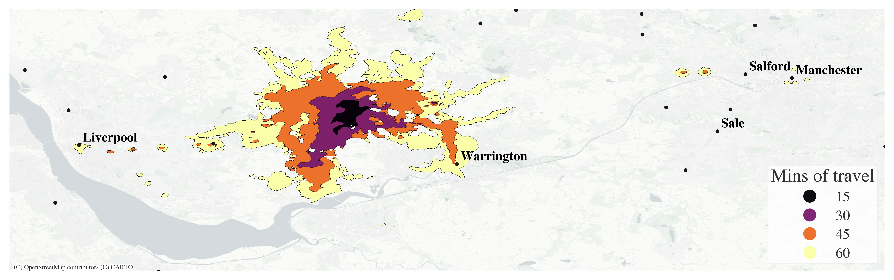

I have a [chapter](https://doi.org/10.37911/9781947864665.11) in a new volume of the *[Sante Fe Institute](https://www.santafe.edu/)*'s series on *The Economy As A Complex Evolving System*. Alongside my chapter, which is about what data science and AI can do for understanding increasingly complex economies, there are contributions on:

- economic complexity analysis (sophistication of product mix)
- disciplining economic agent-based models with data (*highly recommended* if you are building an agent-based model, link [here](https://doi.org/10.37911/9781947864665.10))
- how worker flows cause Zipf's law to in firm sizes
- the ways that complexity and network science can help understand and capture systemic financial stability risk
- the potential of complexity science for understanding rapid disruptions to labour markets
- the (perhaps) missing pieces of firm productivity growth: tacit knowledge and local infrastructure assets that combine non-linearly
- how agent-based models can add climate change, and the behavioural responses to climate change, to macroeconomic models
- and loads more!

In case you're wondering what complexity economics is, it tries to understand the economy as an adaptive system with emergent behaviours. This is as opposed to seeing everything through an aggregate lens or deriving behaviour from representative (and therefore non-interacting) agents. Many applications see tools from physics, biology, computer science, and network science brought to bear on apparent puzzles in economics. There's a good introductory paper at the start of the volume.

And, yes, it's 2026—all the chapters are 100% open access. [You can find links to every chapter here](https://www.sfipress.org/books/eecs-iv).

It really is a treasure trove on what complexity science can add to the study of economics, which, in my view, is a lot.

Oh yeah, and I managed to get an isochrone map of the commute from St Helens in. If you want to know why that's relevant, you'll just have to read the chapter!

