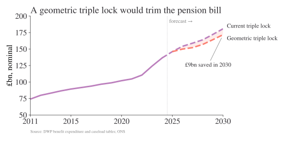

The triple lock is in the news again: the UK’s cost of living tsar, appointed by Sir Keir Starmer, [recently said](https://www.ft.com/content/21527e4b-c720-4078-9209-61e6314e8dc8?syn-25a6b1a6=1) that it was "mathematically unsustainable and "profoundly unfair."[^disclaimer] The [OBR estimates](https://obr.uk/frs/fiscal-risks-and-sustainability-july-2026/) that it will cost £15.5bn more a year by the end of this parliament than it would have under average earnings alone; a not insignificant amount (0.5 per cent of GDP) for government spending. [OBR expects the UK](https://www.ft.com/content/05ab5df6-877b-4e5a-a01d-de9f19b52b37?syn-25a6b1a6=1) to spend *9% of GDP on the triple lock by 2075* absent any action. In the short-term, UK spending on state pensions is forecast to hit £180bn in 2030, up from around £146bn in 2025.

[^disclaimer]: It's always true on here, but your regular reminder that these are my views and do not represent the position of any institution.

However, the political reality of the UK's ageing voting population is that no party wants to risk saying they will "unlock" this policy. And, equally, many people (sensibly) don't want to go back to a world where many pensioners live in poverty either.

The UK's triple lock sees the state pension grow at whatever is highest: average earnings, inflation, or 2.5 per cent. Looking at the latest numbers from ONS and [DWP](https://www.gov.uk/government/publications/benefit-expenditure-and-caseload-tables-2026), it looks like spending as a portion of UK GDP and real spending per pensioner are likely to climb from now until 2030.

But what if there's a way to keep the triple lock but reform it so that it's more in-tune with what's actually happening in the economy?

I'm far from the first to suggest something like this. As one example, the IFS' Heidi Karjalainen [wrote in the FT](https://www.ft.com/content/330c5f50-c475-4cba-9362-e3430aece4cb) that an Australian-style "smoothed earnings link" might be better. This essentially targets a fraction of median real full-time earnings. I like this, though its exact mechanism would have to be set out ahead of time to prevent year-to-year tinkering. Something like this is almost certainly first-best ignoring the politics of the triple lock.

My proposal is a bit different, and tries to reflect the *political reality* around this topic. It's very hard for someone to get up and say we are getting rid of the triple lock. Even saying that it will be replaced by "smoothed earnings" would likely trigger a backlash because it doesn't explicitly account for the three variables that the triple lock tracks. *Any* sense that the triple lock is being broken is likely to generate huge pushback from [the demographic most likely to vote](https://www.google.com/url?sa=t&source=web&rct=j&opi=89978449&url=https://researchbriefings.files.parliament.uk/documents/CBP-8060/CBP-8060.pdf&ved=2ahUKEwjPh9L17M-VAxUwVKQEHfhdHDIQFnoECCAQAQ&usg=AOvVaw3u0t4K_vGAjVBcEUbAaFyf). But a slight change to the maths of the triple lock, while keeping its three components, is much more defensible.

## From the max to the (geometric) mean

The triple lock of today is

$$
\max\left\{2.5\%, \pi_t, \omega_t \right\}
$$

where $\pi_t$ is CPI, and $\omega_t$ is average earnings growth. We could switch that to a different *aggregation function*. It could be the (arithmetic) mean but we're comparing three different growth rates here, so the obvious choice is the *geometric mean*. The growth factors are $1 + x_i$ for each series. Here's the new equation I propose for working out the growth in the state pension:

$$
g(x) = \left( \prod_{i} \left(1 + x_i\right) \right)^{1/|x|} - 1
$$

where $x_i$ are the different growth rates, expressed as fractions. Let's compare how the year-on-year growth rates look under these two different set ups, in @tbl-growth-rates.

```{python}
#| label: tbl-growth-rates
#| tbl-cap: Year-on-year growth rates compared
import pandas as pd
from pathlib import Path
import numpy as np


def geometric_mean(row_of_numbers):
    r"""Geometric mean of the strictly positive entries in a row.
    """

    return (row_of_numbers + 1).prod() ** (1 / len(row_of_numbers)) -1


def return_complete_df():
    df = pd.read_csv(Path("uk_triple_lock.csv"))

    df["2.5_pct"] = 2.5
    df.loc[df["cpi_inflation_pct"].isna(), "2.5_pct"] = np.nan

    df["triple_lock"] = df.loc[:, ["cpi_inflation_pct", "avg_earnings_growth_pct", "2.5_pct"]].max(axis=1)

    df["state_pension_per_pensioner_growth"] = df["state_pension_expenditure_gbp_million"].pct_change() * 100

    df["geom_mean"] = df.loc[
        :, ["cpi_inflation_pct", "avg_earnings_growth_pct", "2.5_pct"]
    ].apply(geometric_mean, axis=1)

    df.loc[df["cpi_inflation_pct"].isna(), "geom_mean"] = np.nan

    starting_value = 100

    end_spend_geom_mean = starting_value*(1+df["geom_mean"]/100.).prod()

    end_spend_triple_lock = starting_value*(1+df["triple_lock"]/100.).prod()
    return df


def trailing_cumulative_growth(growth_rates_pct, window=5):
    r"""Cumulative compound growth over a trailing window, from year-on-year rates.

    Takes a series of year-on-year growth rates in percent and returns, for each
    year $t$, the total growth accumulated over the window ending at (and including)
    $t$:

    $$
    G_t = \left( \prod_{j=0}^{w-1} \left( 1 + \frac{g_{t-j}}{100} \right) \right) - 1
    $$

    Years with fewer than `window` observations behind them are NaN.
    """
    factors = 1 + growth_rates_pct / 100.0
    compounded = factors.rolling(window).apply(np.prod, raw=True)
    return (compounded - 1) * 100

df = return_complete_df()

xf = df.set_index("year").loc[:, ["triple_lock", "geom_mean", "cpi_inflation_pct", "avg_earnings_growth_pct"]].dropna()
starting_value = 100
end_spend_geom_mean = starting_value*(1+df["geom_mean"]/100.).prod()
end_spend_triple_lock = starting_value*(1+df["triple_lock"]/100.).prod()
xf = xf.rename(columns={"cpi_inflation_pct": "CPI", "avg_earnings_growth_pct": "Earnings growth", "triple_lock": "Current triple lock", "geom_mean": "Geometric mean triple lock", }).round(1)

xf
```

As expected, the positive geometric mean triple lock is less than or equal to the current triple lock at all times. It is less generous. If the pension bill started at £100 and was only changing due to the lock, you'd expect the final bill in 2025 to be £`{python} f"{end_spend_geom_mean:.1f}"` under the positive geometric mean triple lock vs £`{python} f"{end_spend_triple_lock:.1f}"` under the original triple lock. That's a saving of `{python} f"{100 * (1 - end_spend_geom_mean / end_spend_triple_lock):.1f}"`% in the level of the state pension today if we had used the positive geometric mean all the way through.[^values]

[^values]: The percentage difference won't match the growth rate of *total* government spending on the state pension because of changes in the number of pensioners. That, and the [triple lock was suspended in 2022/23](https://www.international-adviser.com/pensions-triple-lock-quietly-shelved-for-2022-23/). But, all else equal, a lower compounding effect—as you get with the geometric triple lock—means a lower cost to the state.

The geometric mean is guaranteed to be less than or equal to the max, so we know this choice would make spending a bit lower on average. I would argue that it also reflects the closer underlying economic reality too. Not as well as explicitly targeting median earnings, for sure. But in a way that gets a fair bit closer to that while still retaining the core of a triple lock that reflects CPI, earnings growth, and 2.5 percent.[^negative]

[^negative]: I'm aware that a negative value for the "uprating" is not politically plausible. In this case, it won't make too much difference, and it could have a floor of zero.

## What it means for policy

The triple lock of today has been acknowledged by many to be fiscally unsustainable. Yet, we do want to uprate the state pension given more elderly people often have no easy way to supplement their income, and we don't want a country where many pensioners live in poverty. Politically, eliminating the triple lock entirely is extremely difficult—but tweaking it to better reflect the *average* of CPI, earnings, and 2.5%, rather than the maximum, is—I think—much more politically realistic than the alternatives that have been suggested.

```{python}
df = df.set_index("year")
df["triple_lock_5y"] = trailing_cumulative_growth(df["triple_lock"])
df["geom_mean_5y"] = trailing_cumulative_growth(df["geom_mean"])
df["gdp"] = df["state_pension_expenditure_gbp_million"]*1e6*1/(df["state_pension_expenditure_pct_gdp"]/100)
```

```{python}
# Take base-year spending on pensioners per person and uprate it by the geometric triple lock growth rate, then express as pct gdp

base_year = df["geom_mean"].last_valid_index()  # last year with triple-lock inputs
final_year = df.index.max()
window = 5  # trailing window used in trailing_cumulative_growth

per_pensioner_base = df.loc[base_year, "state_pension_expenditure_gbp_million"]*1e6/(df.loc[base_year, "state_pension_caseload_thousands"]*1e3)

annual_gm_rate = (1 + df["geom_mean_5y"].mean() / 100) ** (1 / window) - 1
per_pensioner_final_gm = per_pensioner_base*(1 + annual_gm_rate)**(final_year - base_year)
total_spend_final_gm = per_pensioner_final_gm*df.loc[final_year, "state_pension_caseload_thousands"]*1e3
df["final_year_gdp_pct_gm"] = total_spend_final_gm/(df["gdp"])
```

```{python}
#| output: false
import matplotlib.pyplot as plt
# import matplotlib_inline

plt.style.use("../../../plot_style.txt")
# matplotlib_inline.backend_inline.set_matplotlib_formats("svg")

spend_bn = df["state_pension_expenditure_gbp_million"] / 1e3
is_outturn = df["state_pension_expenditure_basis"].str.lower() == "outturn"
last_outturn_year = df.index[is_outturn].max()

# Per-year geometric-lock path: annualise the trailing average cumulative
# growth rate, uprate base-year per-pensioner spend, and scale by DWP's caseload.
proj_years = df.loc[base_year:].index
geom_bn = pd.Series(
    per_pensioner_base
    * (1 + annual_gm_rate) ** (proj_years - base_year)
    * df.loc[proj_years, "state_pension_caseload_thousands"].values
    * 1e3
    / 1e9,
    index=proj_years,
)
gap_final = spend_bn.loc[final_year] - geom_bn.loc[final_year]

purple, salmon = "#bc80bd", "#fb8072"
ink = "#323034"

fig, ax = plt.subplots()
ax.plot(spend_bn.loc[:last_outturn_year], color=purple)
ax.plot(spend_bn.loc[last_outturn_year:], color=purple, linestyle="--")
ax.plot(geom_bn, color=salmon, linestyle="--")
ax.fill_between(proj_years, geom_bn, spend_bn.loc[proj_years], color=salmon, alpha=0.15, linewidth=0)

ax.axvline(last_outturn_year + 0.5, color="#b1afb5", linewidth=0.8, linestyle=":")
ax.annotate("forecast →", (last_outturn_year + 0.5, 0.97), xycoords=("data", "axes fraction"),
            xytext=(4, 0), textcoords="offset points", fontsize=11, color="gray", va="top")

ax.annotate("Current triple lock", (final_year, spend_bn.loc[final_year]), xytext=(8, 5),
            textcoords="offset points", fontsize=12, color=ink, va="center", annotation_clip=False)
ax.annotate("Geometric triple lock", (final_year, geom_bn.loc[final_year]), xytext=(8, -8),
            textcoords="offset points", fontsize=12, color=ink, va="center", annotation_clip=False)
ax.annotate(f"£{gap_final:.0f}bn saved in 2030",
            (final_year - 0.1, (geom_bn.loc[final_year - 1] + spend_bn.loc[final_year - 1]) / 2),
            xytext=(-75, -60), textcoords="offset points", fontsize=12, color=ink,
            arrowprops=dict(arrowstyle="-", color="gray", linewidth=0.8))

ax.set_title(f"A geometric triple lock would trim the pension bill")
ax.set_ylabel("£bn, nominal")
first_year = df.index.min()
ax.set_xlim(first_year, final_year)
ax.set_xticks([first_year] + list(range(first_year + 5 - first_year % 5, final_year + 1, 5)))
ax.spines["right"].set_visible(False)
ax.annotate("Source: DWP benefit expenditure and caseload tables; ONS", (0, -0.18),
            xycoords="axes fraction", fontsize=8, color="gray")
plt.tight_layout()
plt.savefig("pension_under_different_locks.svg")
#plt.show()
```

{#fig-pensions}

Although the past is not a guide to the future (we've had some unusual shocks in recent years), the backward-looking five-year average cumulative growth rate under the geometric triple lock vs the current triple lock is `{python} f"{df['geom_mean_5y'].mean():.1f}"`% vs `{python} f"{df['triple_lock_5y'].mean():.1f}"`%. **Projecting the *geometric* triple lock out to 2030, it would cost `{python} f"{df['final_year_gdp_pct_gm'].iloc[-1]*100:.2f}"`% of GDP instead of `{python} f"{df['state_pension_expenditure_pct_gdp'].iloc[-1]:.2f}"`% under the current triple lock** using DWP estimates.

@fig-pensions shows the spend over time: this change results in a saving in 2030 of £`{python} f"{gap_final:.1f}"`bn (and £`{python} f"{(spend_bn.loc[base_year:].sum() - geom_bn.loc[base_year:].sum())/(final_year - base_year):.1f}"`bn a year on average.) Not an insignificant difference, and the average annualised growth rate is still fairly generous to pensioners: it's a balance. It's far from perfect. But, given the political constraints, it may be better than any alternative.
