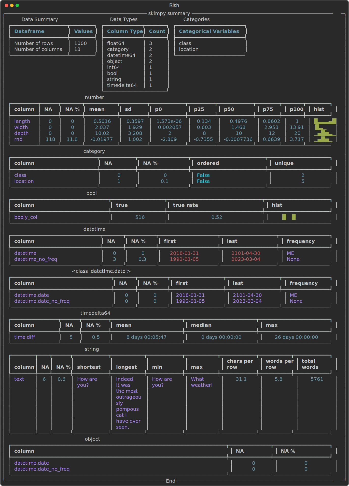

Back in 2020, I wrote a post about [ten lesser known Python packages](../10-lesser-known-python-packages/index.md). Coding and data science have changed a lot in those six years: large language models are the most obvious example! But there have been plenty of other developments too. So I wanted to run down **ten command line tools** that are useful for coding and data science in 2026.

## 1. **uv**

### Project and dependency management

[Astral's uv](https://docs.astral.sh/uv/) has transformed working in Python. Far from the [dependency hell](https://xkcd.com/1987/) of just a couple of years ago, we now have an all-in-one Python package manager, reproducibility tool, and dependency resolver. Data scientists in particular will remember the days of waiting for `conda install` to work out a dependency tree and install a package, and how tricky reproducible environments are to obtain using conda too. I still use Anaconda's [conda tool](https://github.com/conda/conda) for certain situation because it can install things that aren't just Python dependencies (its pre-built binaries can be a life saver on Windows.)[^1]

[^1]: Top tip: if you need to use conda for anything but are finding it slow, try out its fast drop-in replacement, [mamba](https://github.com/mamba-org/mamba).

So why is **uv** so good? Creating the scaffolding for a new project is as simple as `uv init`, and this gives you a `pyproject.toml` where all your packages are recorded.

```text
[project]
name = "hello-world"
version = "0.1.0"
description = "Add your description here"
readme = "README.md"
requires-python = ">=3.10"
dependencies = [
    "pandas>=2.2.3",
    "jupyterlab>=4.3.2",
    "matplotlib>=3.9.3",
    "statsmodels>=0.14.4",
    "graphviz>=0.21",
    "hf-mem>=0.4.4",
]

```

Everything works on a per-repo / per-folder basis, with *one environment per folder* which usually sits in `.venv`. To add packages is as simple as `uv add <packagename>`. This is where the magic happens; **uv** is *fast*:


That speed comes from it being written in Rust.

### Reproducibility

While `pyproject.toml` has high-level dependency information, `uv.lock`, which gets created when you run `uv lock` or `uv sync`, is a cross-platform recipe with exact information about your project's dependencies. Check it in to version control and you can get as close as you can possibly get to cross-platform reproducibility without what is effectively a one-liner.

When someone else, or you, needs to use the project in a fresh environment, they will get the automatically generated `pyproject.toml` and `uv.lock` files. Then, all they need is to navigate to the project folder in the command line, and enter `uv sync --frozen` to install all of the (same versions of) packages needed for the code. For more on reproducibility with **uv**, look at [Coding for Economists](https://aeturrell.github.io/coding-for-economists/wrkflow-rap.html#reproducible-python-environments).

### Python versions

**uv** really is a complete solution because it also comes with the ability to install Python itself, eg:

```bash
uv python install 3.10
```

```text
Installed Python 3.10.19 in 1.26s
 + cpython-3.10.19-macos-aarch64-none (python3.10)
```

### Standalone code scripts

One cool but perhaps less well-known feature is to the ability to run self-contained scripts, aka code with script-level dependencies. The use case for this is when you have a single code file that you need to use in different contexts that's not attached to any wider project. You could make a whole new environment for just that one script but that seems like overkill. Instead, you can declare the dependencies in-line with the script! Let's say you have a file called `example.py` containing:

```python
# /// script
# dependencies = [
#   "requests<3",
#   "rich",
# ]
# ///

import requests
from rich.pretty import pprint

resp = requests.get("https://peps.python.org/api/peps.json")
data = resp.json()
pprint([(k, v["title"]) for k, v in data.items()][:10])
```

This can be run with `uv run example.py`, with the environment and dependencies installed on the fly just to execute the script. I can never remember the syntax at the top of the script, but you can create the file and add dependencies from the command line like so:

```bash
uv init --script example.py --python 3.12
uv add --script example.py 'requests<3' 'rich'
```

### Command line tools

This is going to get meta because **uv** also really helps with command line tools! There are now a lot of command line tools available as Python packages, which is great. But you don't always want them associated with specific projects, maybe you want them on hand all the time, ready to jump in and do their thing in whatever circumstance arises. Well, once again, **uv** has you covered.

To install a tool once to use everywhere on your computer, run:

```bash
uv tool install <package>
```

To then use the tool, you can do

```bash
uvx <package>
```

Some of the tools feature in the rest of this post are Python packages for the command line and can be installed and used in this way.

## 2. **hf-mem** {#sec-hfmem}

The big story of the last few years has been large language models. Increasingly, [as I've argued](../era_local_agentic_llms/index.qmd), we can run them *locally* too, **as long as they fit in RAM**. [`hf-mem`](https://github.com/alvarobartt/hf-mem) is a great little tool you can use to estimate the inference memory requirements for Hugging Face models.

If you didn't read the previous section, you can install this package once, then use everywhere, with

```bash
uv tool install hf-mem
```

and use it with

```bash
uvx hf-mem --model-id mlx-community/Qwen3.5-27b-4bit
```

where you could use any model supported by Hugging Face in place of `uvx hf-mem --model-id mlx-community/Qwen3.5-27b-4bit`.


## 3. **docling**

The rise of large language models has meant that plain text files (.txt, .md, .qmd, .tex, ...) are more important than ever because they can go straight into the context window. Perhaps I'm a simple machine too because, personally, I've always liked writing in plain text files over, say, Microsoft Word and usually begin there and convert to other formats later. [Quarto](https://quarto.org/) is absolutely excellent for this, and I use it for everything from documents to websites to papers to slides. (I even like svg because you can open it up and read the text inside.)

Not everyone is so keen on plain text as a format though! The internet is a place of PDFs, docxs, Powerpoints, and 
PNGS. These make it *much* harder to get the information from them into a format a large language model can work with. But this is where [**docling**](https://github.com/docling-project/docling) comes in—a truly brilliant package from IBM that can convert PDF, DOCX, PPTX, XLSX, HTML, WAV, MP3, WebVTT, images (PNG, TIFF, JPEG, ...), LaTeX, ... to plain text files. **docling** is not just a command tool, in fact, for anything complex you probably want to use it from within a Python script. But it does also work as a nifty command line tool when you just want the text out.

As an example, let's take my [(dormant) working paper](../../../research/dormant-working-papers/hill-bardoscia-turrell/index.qmd) with Ed Hill and Marco Bardoscia on solving heterogeneous agent macro models with deep reinforcement learning, aka [https://arxiv.org/abs/2103.16977](https://arxiv.org/abs/2103.16977).

```bash
uvx docling https://arxiv.org/pdf/2103.16977
```

I'll just show a segment of the output, which was automatically written to a markdown file

```markdown
## 2. Background

Macroeconomic models seek to explain the behaviour of economic variables such as wages, hours worked, prices, investment, interest rates, the consumption of goods and services, and more, depending on the level of complexity. They do this through...
```

Yep, in this case, we didn't even need to download the PDF! **docling** does a good job of navigating the arxiv two-column structure. The equations haven't come down in latex format, but in symbols, but I reckon an LLM could still make sense of this. For the speed and flexibility of inputs/outputs, this is my favourite to-plain-text tool.

## 4. **skimpy**

*Full disclosure: I created this package*

[**skimpy**](https://aeturrell.github.io/skimpy/) is a super-charged version of [**pandas**](https://pandas.pydata.org/)' `df.describe()` that handles a wide range of input data types. You can use it in Python code, but you can also use it as a command line tool. Install with `uv tool install skimpy` and then, to use it:

```bash
uvx skimpy some_data.parquet
```



<!-- ```

from skimpy import skim, generate_test_data, skim_get_figure

df = generate_test_data()

skim_get_figure(df, "skimpy_example.svg")
``` -->

You can `uvx skimpy some_data.csv` too; it works for parquet files, csv files, and even sqlite files. For sqlite files, you'll need to say which table you want with `--table <Your table>`; running without this will come back with a list of tables.

Skimpy uses the powerful csv "sniffer" from [DuckDB](https://duckdb.org/), which is why it's so good at guessing what the data types of the different columns are[^2].

[^2]: Column data type metadata aren't carried by CSV files so it's necessary to guess them. Parquet carries column data types with it.

Right now, if you want to save the table, you'll need to run skimpy through Python code but it's possible the command line interface will expand in future.

## 5. **vhs**

Ever wondered how people create those nifty videos of using command line tools? Me too. One really good option is called [**vhs**](https://github.com/charmbracelet/vhs).[^3] You write a bash script in a ".tape" file that includes recording information and then run it. Here's the `hfmem.tape` I wrote for making the video in @sec-hfmem:

[^3]: For younger fans of Markov Wanderer, VHS stands for Video Home System. It was a [magnetic video tape format](https://en.wikipedia.org/wiki/VHS).


```bash

Output hfmem.gif

# Set up a 1200x600 terminal with 46px font.
Set FontSize 25
Set Width 1200
Set Height 700

# Type a command in the terminal.
Type "uvx hf-mem --model-id mlx-community/Qwen3.5-27B-4bit"

# Pause for dramatic effect...
Sleep 500ms

# Run the command by pressing enter.
Enter

# Admire the output for a bit.
Sleep 5s
```

This results in the gorgeous .gif you see [earlier in the post](#hf-mem). Now, I'd really like the export to be a .svg file. There is a package for that called [termtosvg](https://nbedos.github.io/termtosvg/) which is nice too, but it records you as you go and so (for me) looks a lot more clunky.

## 6. **ollama**

I've said on here that we've entered the [era of local agentic AI](../era_local_agentic_llms/index.qmd), and that capability is built on open models. [**ollama**](https://ollama.com/) provides an easy command line interface to find, download, chat with, and launch open model-based versions of popular CLI versions of Claude and Codex.


Follow the download and install instructions on their website. Once you hit `ollama` in your command line, a text user interface will pop up in your terminal with options to chat to a model directly or launch one of the CLI tools but with a model of your choice (eg Codex with qwen3.5:35b) for agentic coding help. **Ollama** is a game-changer for when you don't have WiFi or you've run out of tokens.

## 7. **pydoclint**

Some would say I'm obsessed with making sure the documentation and code are consistent, or, as someone put it (I forget who) "the documentation is the code." I like a combination of [Quarto](https://quarto.org/) and [QuartoDoc](https://github.com/machow/quartodoc) for this; the latter is similar to autodoc: it picks up public functions from your code and automatically creates docs for them drawing on the doc strings and function signatures. But what if your doc strings are stale? You can imagine how this can happen: functions change purpose over time, more types are introduced, and perhaps even the arguments and return types change. Then your function does one thing but says it does something else! Very irritating, not to mention confusing.

[**pydoclint**](https://github.com/jsh9/pydoclint) is a command line tool for checking that your code and your docstrings are consistent across arguments, returns, raises, and more. You can use it as a pre-commit hook on a per-project basis or directly on the command line:

```bash
uvx pydoclint src/ --style google 
```

where `--style google` sets it to use Google-style docstrings. It's a Python package, so you can install it with `uv tool install pydoclint`.

## 8. **ripgrep**

[**ripgrep**](https://github.com/BurntSushi/ripgrep) (`rg`) is command line tool that recursively searches directories using regex patterns. It's fast, and you can probably guess why: yes, it's written in Rust. A nice feature is that it respects your `.gitignore` file, meaning folders (like `.venv`) that you probably don't *want* to search, are excluded by default.

Here's a typical example of using it (against this blog):

```bash
rg "reproducible analytical pipelines" --type md
```

```text
blog/posts/data-science-maturity/data-science-maturity.md
9:Data science has enormous potential to do good in the public sector. The efficiencies that are possible from automation and reproducible analytical pipelines alone are huge—if you like this is improvement at *existing* tasks. Throw machine learning and advanced analytics into the mix and data science can also complete entirely new tasks, *expanding the horizon of what's possible*. It's an exciting time to be a data scientist.
```

Although there are built-in types, like `md`, you can also glob (`-g`) for any file extension or name you like:

```bash
rg "pydoclint" -g "*.qmd"
```

```text
blog/posts/ten-command-line-tools-for-2026/index.qmd
220:## 7. **pydoclint**
224:[**pydoclint**](https://github.com/jsh9/pydoclint) is a command line tool for checking that your code and your docstrings are consistent across arguments, returns, raises, and more. You can use it as a pre-commit hook on a per-project basis or directly on the command line:
227:uvx pydoclint src/ --style google 
230:where `--style google` sets it to use Google-style docstrings. It's a Python package, so you can install it with `uv tool install pydoclint`.
```

## 9. **cookiecutter**

[**cookiecutter**](https://github.com/cookiecutter/cookiecutter) is a cross-platform command-line utility that creates projects from "cookiecutters" (project templates). The classic use case is that you want to create a new project, say in Python, without repeating all the boilerplate like setting up folders for models, notebooks, and different types of data (perhaps with .gitkeeps in.) Aimed at the right template, it can cut out a lot of the effort in getting going with a new repo.

It's a Python package so you can install it with

```bash
uv tool install cookiecutter
```

Then, to use it, you need a template. Well, luckily, I have two I made earlier! You can read all about my Python [research project template and package template in this previous post](../ultra-modern-python-cookiecutters/index.qmd).

Let's say you wanted to create a new Python package with all the bells and whistles (like [pydoclint](#pydoclint).) You would run,

```bash
uvx cookiecutter https://github.com/aeturrell/cookiecutter-python-package.git
```

This will take you through a series of questions about the new project you want to create, then create it: a ready-to-go ultra-modern Python package in just a few commands. I've used it myself and it has cut out lots of time and mistakes. I'd say it's fairly easy to create your own templates too.

## 10. **fzf**

[**fzf**](https://github.com/junegunn/fzf) is an interactive command-line fuzzy finder: you put a list of stuff in and it lets you fuzzily narrow it down, selecting the line you want. It and **ripgrep** make a good pair: pull out all mentions and then narrow down to the one you're looking for. In the below example, ripgrep finds all instances of "import pandas" in Python files and then pipes it (`|`) to fzf for further selection:

```bash
rg "import pandas" --type py | fzf
```


Now wait because it gets even better: you can combine these commands with bat[^4] too to create a fully-fledged interactive text search with file preview. This is a custom function I've defined, called `rgf`, which combines the three tools.

[^4]: A command line text file viewer.

Here's what it looks like in practice:


Once you've found what you're looking for, hitting return will open the file in Visual Studio Code *at the selected line*!

To set this up on Mac, you'll need to `brew install` [**rg**](https://github.com/BurntSushi/ripgrep), [**bat**](https://github.com/sharkdp/bat), and [**fzf**](https://github.com/junegunn/fzf). Then add the following to your `.zshrc` file, if you're using ZSH (amend according to your setup.) You can open the file in an editor with `code ~/.zshrc`. Then add this to the end of the file:

```bash
# ripgrep + fzf interactive search → VS Code
rgf() {
  local result
  result=$(
    rg --color=always --line-number --no-heading --smart-case "$@" |
      fzf --ansi \
          --delimiter : \
          --preview 'bat --color=always --highlight-line {2} --map-syntax "*.qmd:Markdown" {1}' \
          --preview-window 'up,60%,border-bottom,+{2}+3/3,~3'
  )
  if [[ -n "$result" ]]; then
    local file line
    file=$(echo "$result" | cut -d: -f1)
    line=$(echo "$result" | cut -d: -f2)
    code --goto "${file}:${line}"
  fi
}
```

Now you can use commands like

```bash
rgf "import pandas" -g "*.qmd"
```

to interactively, fuzzily, and quickly search your files.
