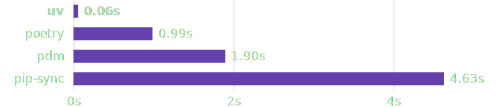

Back in 2020, I wrote a post about [ten lesser known Python packages](../10-lesser-known-python-packages/index.md). Coding and data science have changed a lot in those six years: large language models are the most obvious example! But there have been plenty of other developments too. So I wanted to run down **ten command line tools** that are useful for coding and data science in 2026.

## 1. `uv`

### Project and dependency management

[Astral's uv](https://docs.astral.sh/uv/) has transformed working in Python. Far from the [dependency hell](https://xkcd.com/1987/) of just a couple of years ago, we now have an all-in-one Python package manager, reproducibility tool, and dependency resolver. Data scientists in particular will remember the days of waiting for `conda install` to work out a dependency tree and install a package, and how tricky reproducible environments are to obtain using conda too. I still use Anaconda's [conda tool](https://github.com/conda/conda) for certain situation because it can install things that aren't just Python dependencies (its pre-built binaries can be a life saver on Windows.)[^1]

[^1]: Top tip: if you need to use conda for anything but are finding it slow, try out its fast drop-in replacement, [mamba](https://github.com/mamba-org/mamba).

So why is **uv** so good? Creating the scaffolding for a new project is as simple as `uv init`, and this gives you a `pyproject.toml` where all your packages are recorded.

```text
[project]
name = "hello-world"
version = "0.1.0"
description = "Add your description here"
readme = "README.md"
requires-python = ">=3.10"
dependencies = [
    "pandas>=2.2.3",
    "jupyterlab>=4.3.2",
    "matplotlib>=3.9.3",
    "statsmodels>=0.14.4",
    "graphviz>=0.21",
    "hf-mem>=0.4.4",
]

```

Everything works on a per-repo / per-folder basis, with *one environment per folder* which usually sits in `.venv`. To add packages is as simple as `uv add <packagename>`. This is where the magic happens, **uv** is *fast*:



### Reproducibility

While `pyproject.toml` has high-level dependency information, `uv.lock`, which gets created when you run `uv lock` or `uv sync`, is a cross-platform recipe with exact information about your project's dependencies. Check it in to version control and you can as close as you can possibly get to cross-platform reproducibility.

When someone else, or you, need to use the project in a fresh environment, they will get the automatically generated `pyproject.toml` and `uv.lock` files. Then, all they need is to navigate to the project folder in the command line, and enter `uv sync --frozen` to install all of the (same versions of) packages needed for the code. For more on reproducibility with uv, look at [Coding for Economists](https://aeturrell.github.io/coding-for-economists/wrkflow-rap.html#reproducible-python-environments).

### Python versions

**uv** really is a complete solution because it also comes with the ability to install Python itself, eg:

```bash
uv python install 3.10
```

```text
Installed Python 3.10.19 in 1.26s
 + cpython-3.10.19-macos-aarch64-none (python3.10)
```

### Standalone code scripts

One cool, and perhaps less well-known, feature is to the ability to run self-contained scripts, aka code with script-level dependencies. The use case for this is when you have a single code file that you need to use in different contexts that's not attached to any wider project. You could make a whole new environment for just that one script but that seems like overkill. Instead, you can declare the dependencies in-line with the script! Let's say you have a file called `example.py` containing:

```python
# /// script
# dependencies = [
#   "requests<3",
#   "rich",
# ]
# ///

import requests
from rich.pretty import pprint

resp = requests.get("https://peps.python.org/api/peps.json")
data = resp.json()
pprint([(k, v["title"]) for k, v in data.items()][:10])
```

This can be run with `uv run example.py`, with the environment and dependencies installed on the fly just to execute the script. I can never remember the syntax at the top of the script, but you can create the file and add dependencies from the command line like so:

```bash
uv init --script example.py --python 3.12
uv add --script example.py 'requests<3' 'rich'
```

### Command line tools

This going to get meta because **uv** also really helps with command line tools! There are now a lot of command line tools available as Python packages, which is great. But you don't always want them associated with specific projects, maybe you want them on hand all the time, ready to jump in and do their thing in whatever circumstance arises. Well, once again, **uv** has you covered.

To install a tool once to use everywhere in **uv**, run:

```bash
uv tool install <package>
```

To then use the tool, you can do

```bash
uvx <package>
```

The rest of this post is going to show you some cool command line tools that you can install with `uv tool install`.

## 2. **hf-mem** {#sec-hfmem}

If you didn't read the previous section, you can install this package once, then use everywhere, with 

```bash
uv tool install hf-mem
```

and 

```bash
uvx hf-mem
```

The big story of the last few years has been large language models. Increasingly, [as I've argued](../era_local_agentic_llms/index.qmd), we can run them *locally* too, **as long as they fit in RAM**. [`hf-mem`](https://github.com/alvarobartt/hf-mem) is a great little tool you can use to estimate the inference memory requirements for Hugging Face models.


## 3. **docling**

The rise of large language models has meant that plain text files (.txt, .md, .qmd, .tex, ...) are more important than ever because they can go straight into the context window. Perhaps I'm a simple machine too because, personally, I've always liked writing in plain text files over, say, Microsoft Word and usually begin there and convert to other formats later. [Quarto](https://quarto.org/) is absolutely excellent for this, and I use it for everything from documents to websites to papers to slides. (I even like svg because you can open it up and read the text inside.)

Not everyone is so keen on plain text as a format though! The internet is a place of PDFs, docxs, Powerpoints, and 
PNGS. These make it *much* harder to get the information from them into a format a large language model can work with. But this is where [**docling**](https://github.com/docling-project/docling) comes in—a truly brilliant package from IBM that can convert PDF, DOCX, PPTX, XLSX, HTML, WAV, MP3, WebVTT, images (PNG, TIFF, JPEG, ...), LaTeX, ... to plain text files. **docling** is not just a command tool, in fact, for anything complex you probably want to use it from within a Python script. But it does also work as a nifty command line tool when you just want the text out.

As an example, let's take my (dormant) working paper with Ed Hill and Marco Bardoscia on solving heterogeneous agent macro models with deep reinforcement learning, aka [https://arxiv.org/abs/2103.16977](https://arxiv.org/abs/2103.16977).

```bash
uvx docling https://arxiv.org/pdf/2103.16977
```

I'll just show a segment of the output, which was automatically written to a markdown file

```markdown
## 2. Background

Macroeconomic models seek to explain the behaviour of economic variables such as wages, hours worked, prices, investment, interest rates, the consumption of goods and services, and more, depending on the level of complexity. They do this through 'microfoundations', that is describing the behaviour of individual agents and deriving the system-wide behaviour based on how those atomic behaviours aggregate. An important class of these models is used to describe how variables co-move in time when supply and demand are balanced (in general equilibrium ), and when some variables are subject to stochastic noise (aka 'shocks'). A typical macroeconomic rational expectations model with general equilibrium is a representation of an economy populated by households, firms, and public institutions (such as the government). The choices made by these distinct agents are framed as a dynamic programming problem in which households maximise their discounted future utility U = E ∑ ∞ t =1 β t u ( s t , a t ) with u per-period utility, β a discount factor, s t ∈ S a vector of state variables, a t ∈ a ( s t ) a vector of choice variables, and s t evolving as s t +1 = h ( s t , a t ) . E ( · ) represents an expectation operator, usually assumed to be 'rational' in the sense of being the households' best possible forecast given the available information (and implying that any deviations from perfect foresight are random). For household agents, u is monotonically increasing in consumption, c t , and decreasing in hours worked, n t (both choice variables). Extra conditions are imposed via other equations, for example, a budget constraint of the form (1 + r t ) b t -1 + w t n t ≥ p t c t + b t with p t price, w t wages, and r the interest rate. b t captures savings, typically in the form of a risk-free bond or other investment. If b t &lt; 0 is permitted (i.e. debt) then b t usually satisfies a 'no Ponzi' condition that rules out unlimited borrowing and effectively imposes the rule that b T = 0 ( t ∈ 0 , . . . , T ). Consumers take prices, wages, and interest rate as given; these are state variables. Firms maximise profits Π t = p t Y t -w t N t (possibly including a -r t K t term if savings are invested) subject to a 'production constraint', Y t , that turns labour, N t , and capital, K t into consumption goods. Typically, Y t = A t f ( K t , N t ) where f is a monotonically increasing function of its inputs and A t is either predetermined or follows a log-autoregressive process ln A t = ρ A ln A t -1 + glyph[epsilon1] t ; glyph[epsilon1] t ∼ N (0 , σ A ) is known as a technology 'shock'. Governments perform functions such as the collection and redistribution of taxes. Firms are assumed to be perfectly competitive, meaning that each firm takes prices and wages as given.
```

Yep, in this case, we didn't even need to download the PDF! **docling** does a good job of navigating the arxiv two-column structure. The equations haven't come down in latex format, but in symbols, but I reckon an LLM could still make sense of this. For the speed and flexibility of inputs/outputs, this is my favourite to-plain-text tool.

## 4. **skimpy**

*Full disclosure: I created this package*

[**skimpy**](https://aeturrell.github.io/skimpy/) is a super-charged version of [**pandas**](https://pandas.pydata.org/)' `df.describe()` that handles a wide range of input data types. You can use it in Python code, but you can also use it as a command line tool. Install with `uv tool install skimpy` and then, to use it:

```{python}
#| echo: False
import pandas as pd

df = pd.DataFrame({
    'name': ['Alice', 'Bob', 'Charlie'],
    'age': [25, 30, 35],
    'city': ['London', 'New York', 'Tokyo'],
    "likes_cheese": [False, True, True],
    "record_date": pd.date_range("01-01-2026", periods=3, freq="D")
})
df.to_csv("csv_example.csv")
df.to_parquet("pq_example.parquet")
```

```{bash}
uvx skimpy csv_example.csv
```

```{bash}
uvx skimpy pq_example.parquet
```

```{bash}
#| echo: False

rm csv_example.csv
rm pq_example.parquet

```

Yes, it works for parquet files, csv files, and even sqlite files. For sqlite files, you'll need to say which table you want with `--table <Your table>`; running without this will come back with a list of tables.

Skimpy uses the powerful csv "sniffer" from [DuckDB](https://duckdb.org/), which is why it's so good at guessing what the data types of the different columns are[^2].

[^2]: Column data type metadata aren't carried by CSV files so it's necessary to guess them. Parquet carries column data types with it.

Right now, if you want to save the table, you'll need to run skimpy through Python code but it's possible the command line interface will expand in future.

## 5. **vhs**

Ever wondered how people create those nifty videos of using command line tools? Me too. One really good option is called [**vhs**](https://github.com/charmbracelet/vhs).[^3] You write a bash script in a ".tape" file that includes recording information and then run it. Here's the `hfmem.tape` I wrote for making the video in @sec-hfmem:

[^3]: For younger fans of Markov Wanderer, VHS stands for Video Home System. It was a [magnetic video tape format](https://en.wikipedia.org/wiki/VHS).


```bash

Output hfmem.gif

# Set up a 1200x600 terminal with 46px font.
Set FontSize 25
Set Width 1200
Set Height 700

# Type a command in the terminal.
Type "uvx hf-mem --model-id mlx-community/Qwen3.5-27B-4bit"

# Pause for dramatic effect...
Sleep 500ms

# Run the command by pressing enter.
Enter

# Admire the output for a bit.
Sleep 5s
```

This results in the gorgeous .gif you see earlier in the post. Now, I'd really like the export to be a .svg file. There is a package for that called [termtosvg](https://nbedos.github.io/termtosvg/) which is nice too, but it records you as you go and so (for me) looks a lot more clunky.

