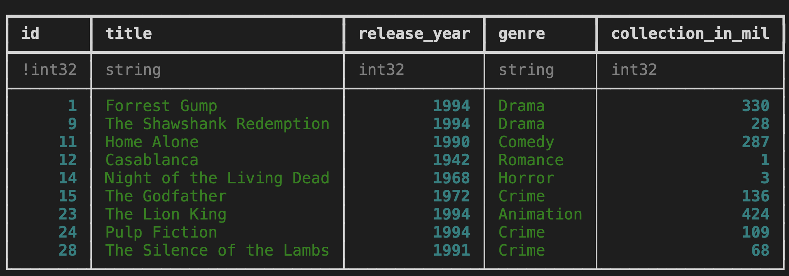

In this TIL, I find out how to create a new [MySQL database](https://dev.mysql.com/) on Microsoft Azure. This is a place to store structured, tabular data. Note that the instructions below assume you are using a bash-like terminal, for example [zsh](https://ohmyz.sh/), rather than [Powershell](https://learn.microsoft.com/en-us/powershell/).

## Prerequisites

You'll need to sign up for a Microsoft Azure account for this, and create a "resource group". You'll also need the Azure Command Line Interface (CLI), which you can find information [on here](https://learn.microsoft.com/en-us/cli/azure/). (Alternatively, you can do this through the [Azure Portal](https://portal.azure.com/#home), but it's often useful to have the reproducible commands.)

It's also helpful to understand the lingo and how different bits of the cloud-based SQL setup relate to one another:

- there is the resource group, which many Azure services could live under
- there is a server, which co-ordinates resources
- there are individual databases, which live on particular services

These three are hierarchical: a database lives on a server that sits under a particular resource group.

You may be wondering why MySQL rather than another type of SQL database? The pricing information is quite difficult to parse, but for hobby projects, it looks like a MySQL database is a lot cheaper than an Azure SQL (MSSQL) database. A basic MySQL database (burstable, b1ms model) is around US$13.00 per month whereas a provisioned Azure SQL database is hundreds of dollars a month. The latter option has a more complex set of options too, though, so there's more to make a mistake with. So we'll be going with the open source MySQL in this case.

## Instructions

### Creating a MySQL server

First set and load your configs. You'll need to decide on a login and password for your SQL server.

```bash
resourcegroup=<>
server=<>
login=<>
password=<>
location=<>  # eg "uksouth"
```

Then to create the server (with conservative cost settings), it's

```bash
az mysql flexible-server create --location $location --resource-group $resourcegroup --name $server --admin-user $login --admin-password $password --sku-name Standard_B1ms --tier Burstable --public-access Enabled --version 5.7 --high-availability Disabled --storage-auto-grow Disabled
```

### Configure permissions to use the SQL server

The default options are cautious on two sets of permissions, the certificate and the IP addresses that are allowed to connect. We need to open these up for your computer.

Go on to Azure portal page for the newly created server and click "configure networking". Then enable connections from your specific IP address through the firewall ("add current client IP address"). On the same page, there's an option to download the SSL certificate. Do this, and put it in a secrets folder that is not under version control.

### Connect to the SQL server using the command line

Let's check that it worked! Assuming you saved the SSL certificate as `sql_cert.crt.pem` in the *same directory in which you are working*, you should be able to run the following on the command line:

```bash
mysql -h $server.mysql.database.azure.com -u $login -p "--ssl-ca=sql_cert.crt.pem"
```

If you saved the certificate in `secrets/`, change the path in the above command appropriately.

Note that you may need to regenerate the `.pem` file from time to time.

Note also that if you are accessing this resource through a VPN or other managed network, this is where you may have difficulties. To circumvent these, you can use a normal internet connection or connect from a virtual machine.

### Working with the SQL database from Python

Python has a number of great tools for working with SQL databases. For this, we'll look at just two: [MySQL Connector](https://dev.mysql.com/doc/connector-python/en/) and the wonderful [Ibis project](https://ibis-project.org/), which translates across a wide number of data analysis backends.

Just as we did before, we need to plug in our credentials. The syntax is slightly different from bash and it's recommended to use a secrets manager like [python-dotenv](https://github.com/theskumar/python-dotenv) to manage these and ensure they do not get mistakenly committed to version control.

```python
username = <>
password = <>
hostname = "<>.mysql.database.azure.com"
```

#### Connecting and creating a database with MySQL Connector

Next, we start up the connection.

```python
mydb = mysql.connector.connect(
  host=hostname,
  user=username,
  password=password,
  ssl_ca="secrets/sql_cert.crt.pem",
)
```

where it's assumed that the certificate is in a folder called secrets.

If running this works, you won't see an error message or a confirmation message, but you can check all is as it should be by running:

```python
print(mydb)
```

which should result in something like:

```text
<mysql.connector.connection_cext.CMySQLConnection object at 0x3213r4g90>
```

Now it's not very exciting to have a SQL server with no databases in. So, next, we're going to create a database.

```python
create_db_query = "CREATE DATABASE online_movie_rating"
mycursor = mydb.cursor()
mycursor.execute(create_db_query)
```

If you then run

```python
mycursor.execute("Show databases;")
for db in mycursor:
    print(db)
```

you'll get a list of databases that should include `online_movie_rating`.

But an empty database is no fun—let's populate it. First, the table we wish to create:

```python
create_movies_table_query = """
CREATE TABLE movies(
    id INT AUTO_INCREMENT PRIMARY KEY,
    title VARCHAR(100),
    release_year YEAR(4),
    genre VARCHAR(100),
    collection_in_mil INT
)
"""
```

And then the execution of that create table command:

```python
mydb = mysql.connector.connect(
  host=hostname,
  user=username,
  password=password,
  database="online_movie_rating",
  ssl_ca="secrets/sql_cert.crt.pem",
)
mycursor = mydb.cursor()
mycursor.execute(create_movies_table_query)
mydb.commit()
```

Note the difference with the earlier command—this one has a `database=` keyword argument in it.

With the table created, we can also populate it with some data:

```python
insert_movies_query = """
INSERT INTO movies (title, release_year, genre, collection_in_mil)
VALUES
    ("Forrest Gump", 1994, "Drama", 330.2),
    ("3 Idiots", 2009, "Drama", 2.4),
    ("Eternal Sunshine of the Spotless Mind", 2004, "Drama", 34.5),
    ("Good Will Hunting", 1997, "Drama", 138.1),
    ("Skyfall", 2012, "Action", 304.6),
    ("Gladiator", 2000, "Action", 188.7),
    ("Black", 2005, "Drama", 3.0),
    ("Titanic", 1997, "Romance", 659.2),
    ("The Shawshank Redemption", 1994, "Drama",28.4),
    ("Udaan", 2010, "Drama", 1.5),
    ("Home Alone", 1990, "Comedy", 286.9),
    ("Casablanca", 1942, "Romance", 1.0),
    ("Avengers: Endgame", 2019, "Action", 858.8),
    ("Night of the Living Dead", 1968, "Horror", 2.5),
    ("The Godfather", 1972, "Crime", 135.6),
    ("Haider", 2014, "Action", 4.2),
    ("Inception", 2010, "Adventure", 293.7),
    ("Evil", 2003, "Horror", 1.3),
    ("Toy Story 4", 2019, "Animation", 434.9),
    ("Air Force One", 1997, "Drama", 138.1),
    ("The Dark Knight", 2008, "Action",535.4),
    ("Bhaag Milkha Bhaag", 2013, "Sport", 4.1),
    ("The Lion King", 1994, "Animation", 423.6),
    ("Pulp Fiction", 1994, "Crime", 108.8),
    ("Kai Po Che", 2013, "Sport", 6.0),
    ("Beasts of No Nation", 2015, "War", 1.4),
    ("Andadhun", 2018, "Thriller", 2.9),
    ("The Silence of the Lambs", 1991, "Crime", 68.2),
    ("Deadpool", 2016, "Action", 363.6),
    ("Drishyam", 2015, "Mystery", 3.0)
"""
mycursor.execute(insert_movies_query)
mydb.commit()
```

Let's see if we can retrieve some of this:

```python
select_movies_query = "SELECT * FROM movies LIMIT 5"
mycursor.execute(select_movies_query)
result = mycursor.fetchall()
for row in result:
    print(row)
```

```text
(1, 'Forrest Gump', 1994, 'Drama', 330)
(2, '3 Idiots', 2009, 'Drama', 2)
(3, 'Eternal Sunshine of the Spotless Mind', 2004, 'Drama', 35)
(4, 'Good Will Hunting', 1997, 'Drama', 138)
(5, 'Skyfall', 2012, 'Action', 305)
```

Finally, to close the connection, use `mydb.close()`.

#### Using Ibis to work with a cloud-based SQL database

The [Ibis project](https://ibis-project.org/) makes working with a ton of different back-end data tools easy by making the syntax consistent. Examples are: MySQL, BigQuery, DuckDB, pandas, MSSQL, and much, much more!

Once you've imported **Ibis** (`import ibis`), you may find it more fun and useful to use it in interactive mode, which looks more like how **pandas** works:

```python
ibis.options.interactive = True
```

To see some data, we need to create a connection:

```python
con = ibis.mysql.connect(
    user=username,
    password=password,
    host=hostname,
    port=3306,
    database="online_movie_rating",
    ssl_ca="sql/sql_cert.crt.pem",
)
```

And to grab our "movies" table again, but as a **pandas** dataframe:

```python
t = con.table("movies")
t.head().to_pandas()
```

|   | id | title                                 | release_year | genre  | collection_in_mil |
|---|----|---------------------------------------|--------------|--------|-------------------|
| 0 | 1  | Forrest Gump                          | 1994         | Drama  | 330               |
| 1 | 2  | 3 Idiots                              | 2009         | Drama  | 2                 |
| 2 | 3  | Eternal Sunshine of the Spotless Mind | 2004         | Drama  | 35                |
| 3 | 4  | Good Will Hunting                     | 1997         | Drama  | 138               |
| 4 | 5  | Skyfall                               | 2012         | Action | 305               |

Ibis is great to explore data. It has fully fledged **pandas**-style *and* SQL-style APIs. So you can do:

```python
t.filter(t.release_year<1996)
```



But you can also get this as SQL:

```python
ibis.to_sql(t.filter(t.release_year<1996))
```

```sql
SELECT
  t0.id,
  t0.title,
  t0.release_year,
  t0.genre,
  t0.collection_in_mil
FROM movies AS t0
WHERE
  t0.release_year < 1996
```

It's a really powerful downstream analysis tool.

And that's it! Most other SQL commands are as you'd expect and can be looked up in the MySQL documentation.
