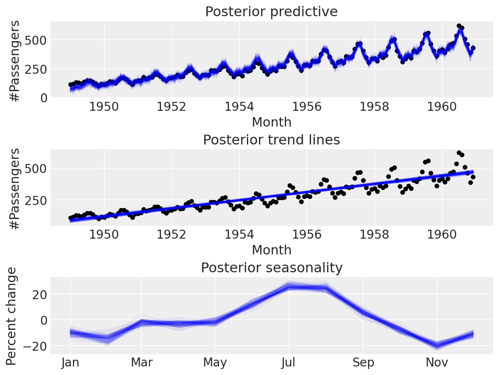

There have been a series of sometimes jaw-dropping developments in data science in the last few years, with large language models by far the most prominent (and with good reason). But another story has been the huge explosion in time series packages.

Were you really a tech firm circa 2020--2023 if you didn't release your own time series package? Looking at what's available and from who, maybe not: Facebook/Meta got the ball rolling with Prophet, but since then we've seen ones from Uber, LinkedIn, Amazon, Google, and Meta again. And it's not hard to see why time series forecasting might be so valuable at these digital-first, data-rich firms. Just as with data orchestration tools, everyone else is seeing some benefit from their labours.

In the rest of this post, we'll look at the new(ish) time series packages that are around, who built them, and what they might be good for.

{width=60% fig-alt="Posteriors for outturn, trend, and seasonality."}

## Background

Of course, all of this began, at least in my mind, with Meta's [Prophet](https://facebook.github.io/prophet/). This provided a quick solution to structural time series modelling out of the box. And it responded well to the needs of those with high frequency data by using Python's [holidays](https://pypi.org/project/holidays/) package to allow for holiday fixed effects. Being able to deal with hourly and daily data is crucial to tech firms inundated with data, so it's easy to see why this was built in. And when the pandemic hit, and everything was changing day by day (sometimes exponentially), everyone else was suddenly interested in high-frequency data too.

Prophet has had some criticism, even getting [some blame](https://ryxcommar.com/2021/11/06/zillow-prophet-time-series-and-prices/) for [Zillow's struggles with property trading](https://www.cnet.com/personal-finance/mortgages/what-happened-at-zillow-how-a-prized-real-estate-site-lost-at-ibuying/). But I think it's a bit unfair because Prophet moved data science forecasting on considerably: it performed well out of the box in a wide variety of situations and had support for high-frequency data that didn't exist in many other packages at the time. In short, it's actually a great package, and has become a kind of reference point for every other time series package—and it seems like it did start something.

Perhaps the [forecasting competitions](https://mofc.unic.ac.cy/) and appearances of websites like papers with code, which has a [time series forecasting](https://paperswithcode.com/task/time-series-forecasting) section, is driving innovation here too, alongside the aforementioned interest in actually using these tools in a business context.

Either way, data scientists are benefitting: the explosion hasn't just been in the number of time series packages (which may not be adding much!), but in the number of methods on offer too. In particular, some of the latest machine learned-based time series forecasting methods are making it into the packages alongside classic methods such as ARIMA. This is quite a contrast from five or ten years ago when most people were relying on one or two approaches in a handful of packages, mostly [**statsmodels**](https://www.statsmodels.org/) in Python and [**forecast**](https://github.com/robjhyndman/forecast) plus a couple of others in R. Of course, new doesn't necessarily mean better, but the innovation and choice are welcome, and it's almost certainly easier now to find a time series forecasting tool that has good performance on your problem.

It's worth saying that while these new packages bring lots that is good, like state of the art (SOTA) machine learning (ML) models, and super modern fast fitting algorithms, their understandable focus on the needs of tech firms can mean they're less well-suited, at least out of the box, to lower frequency data.

## The packages

So what does the landscape look like today? Well, of course, it depends on where we draw the line. Anything that can predict a number can be used for time series forecasting, so all of [scikit-learn](https://scikit-learn.org/) and [pytorch](https://pytorch.org/) would qualify. But we're going to focus on packages that can do competent time series analysis more or less out of the box. Secondly, we're going to focus more on forecasting than, say, classification or anomaly detection—though a lot of the libraries below offer these features too. Similarly, more time series feature discovery packages ([featuretools](https://github.com/alteryx/featuretools), [tsfresh](https://github.com/blue-yonder/tsfresh)) have appeared, but we won't cover those. Finally, I also ignored packages that didn't seem to be under active development or being maintained.

Let's dive into what's on offer now for *time series forecasting*. The table below gives the name, organisation, and homepage of each package. The "About" column is largely drawn from the websites of these packages, with some extra context in italics.

As you can see from the table, we're spoiled for choice right now. I guess you could say, for data scientists doing forecasting, times are good 😉.

| Package | Organisation | About |
|---|---|---|
| [statsforecast](https://github.com/Nixtla/statsforecast) | Nixtla | *This seems highly optimised for speed*. StatsForecast offers a collection of widely used univariate time series forecasting models, including automatic ARIMA, ETS, CES, and Theta modeling optimized for high performance using numba. It also includes a large battery of benchmarking models. Some other claimed features are: fastest implementations of a bunch of algorithms; compatibility with Spark, Dask, and Ray; confidence intervals; support for exogenous variables; 500x faster than prophet; and 20x faster than pmdarima. |
| [Prophet](https://facebook.github.io/prophet/) | Facebook | *The OG. Has an R version too.* “Forecasting time series data based on an additive model where non-linear trends are fit with yearly, weekly, and daily seasonality, plus holiday effects. It works best with time series that have strong seasonal effects and several seasons of historical data. Prophet is robust to missing data and shifts in the trend, and typically handles outliers well.” |
| [Kats](https://github.com/facebookresearch/Kats) | Facebook | A kit to analyse time series data. A lightweight, easy-to-use, generalizable, and extendable framework to perform time series analysis, from understanding the key statistics and characteristics, detecting change points and anomalies, to forecasting future trends. |
| [sktime](https://www.sktime.net/) | Alan Turing Institute | Python framework for ML and AI with time series, full list of features [here](https://www.sktime.net/en/stable/estimator_overview.html). |
| [pmdarima](https://github.com/alkaline-ml/pmdarima) | Alkaline ML | A statistical library designed to fill the void in Python's time series analysis capabilities, including the equivalent of R's auto.arima function. |
| [greykite](https://linkedin.github.io/greykite/) | LinkedIn | An open source Python library developed to support LinkedIn’s forecasting needs. Its main forecasting algorithm, called Silverkite, is fast, accurate, and intuitive, making it suitable for interactive and automated forecasting at scale. The Silverkite algorithm works well on most time series, and is especially adept for those with changepoints in trend or seasonality, event/holiday effects, and temporal dependencies. Its forecasts are interpretable and therefore useful for trusted decision-making and insights. |
| [orbit](https://github.com/uber/orbit) | Uber | A Python package for Bayesian forecasting with object-oriented design and probabilistic models under the hood. Focuses on exponential smoothing and kernel-based time-varying regression. |
| [Darts](https://unit8co.github.io/darts/) | Unit8 | *This looks like an especially high quality package*. A python library for user-friendly forecasting and anomaly detection on time series. Contains a variety of models, from classics such as ARIMA to deep neural networks. Huge set of models.  |
| [tsai](https://github.com/timeseriesAI/tsai) | timeseriesAI | *Seems like the best place to get SOTA ML time series forecasting capabilities*. tsai is an open-source deep learning package built on top of Pytorch & fastai focused on state-of-the-art techniques for time series tasks like classification, regression, forecasting, imputation. |
| [gluonts](https://ts.gluon.ai/stable/) | Amazon | Probabilistic time series modelling in Python. GluonTS is a Python package for probabilistic time series modelling, focusing on deep learning based models, based on PyTorch and MXNet. |
| [neuralprophet](https://neuralprophet.com/) | Stanford University | *Has a focus on interpretability*. An easy to learn framework for interpretable time series forecasting. NeuralProphet is built on PyTorch and combines Neural Network and traditional time-series algorithms, inspired by Facebook Prophet and AR-Net. |
| [merlion](https://github.com/salesforce/Merlion) | salesforce | *Focus on easy-to-use interface (including a GUI), so possibly good for colleagues who can’t code but need to use the latest forecasting models.* Provides an end-to-end machine learning framework that includes loading and transforming data, building and training models, post-processing model outputs, and evaluating model performance. It supports various time series learning tasks, including forecasting, anomaly detection, and change point detection for both univariate and multivariate time series. |
| [PyMC](https://www.pymc.io/) | PyMC | *This is a bit more build your own, but they just added support for [state-space models](https://discourse.pymc.io/t/pymc-experimental-now-includes-state-spaces-models/12773) so it’s made it onto the list, and it has some good [time series examples](https://www.pymc.io/projects/examples/en/latest/gallery.html#time-series) in the documentation.* PyMC is a probabilistic programming library for Python that allows users to build Bayesian models with a simple Python API and fit them using Markov chain Monte Carlo (MCMC) methods. |
| [neuralforecast](https://github.com/Nixtla/neuralforecast) | Nixtla | *Another entry from Nixtla, but this time implementing high-performing neural network based time series forecasting. Less popular than its other package.* |
| [AutoTS](https://github.com/winedarksea/AutoTS) | winedarksea | Time series package for Python designed for rapidly deploying high-accuracy forecasts at scale. Includes naive, statistical, machine learning, and deep learning models. |

: {.striped .hover tbl-colwidths="[20,20,60]"}
